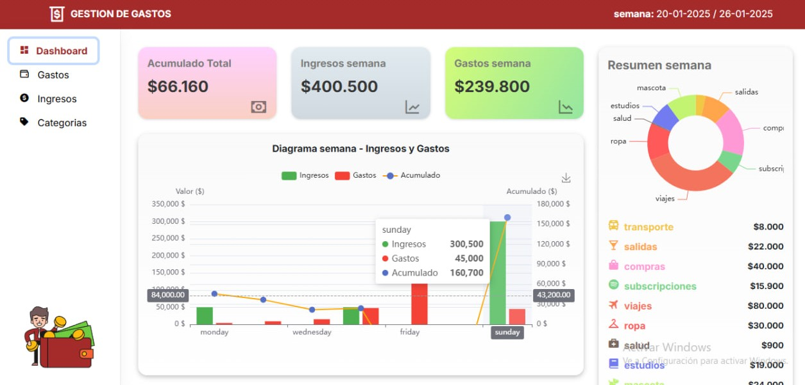
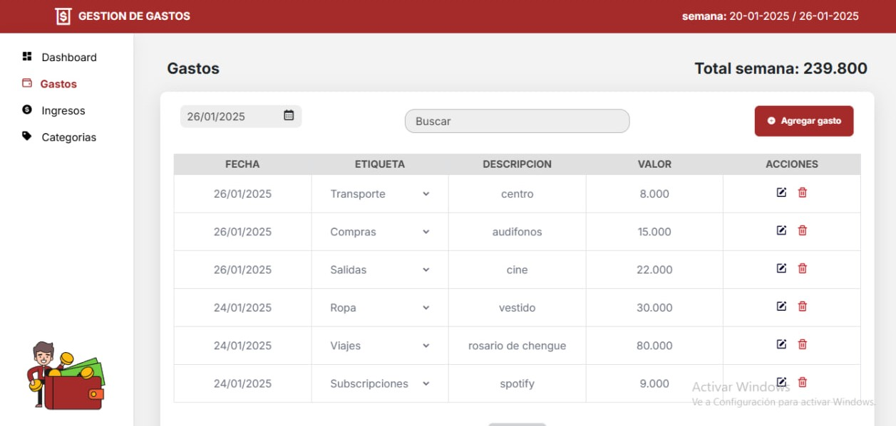

# Web para Gestionar Gastos 

Esta página web permite llevar un control detallado de ingresos y egresos semanales. Ofrece herramientas para visualizar datos financieros y administrar gastos de manera eficiente.  
📎 https://youtu.be/bGLWdjngTpo?si=mmH7NSF_GfVV78qV

## Front-End https://github.com/dailinr/gestion-gastos

### 📊 Dashboard y Visualización de Datos

* Gráficos y diagramas para una mejor comprensión de los ingresos y gastos.
* Resumen total de todas las semanas registradas.
* Visualización de ingresos y gastos de la semana actual.
* Diagrama que categoriza los gastos y muestra el acumulado por categoría.
* Comparación de ingresos y gastos diarios con gráficos de barras.
* Los registros están organizados por semanas. Navegación entre semanas mediante paginación.

## 📌 Gestión de Gastos

* Visualización de registros acumulados de la semana.
* Cálculo total del gasto semanal.
* Posibilidad de agregar nuevos gastos mediante un formulario con campos obligatorios.
* Selección de etiquetas predefinidas para clasificar los gastos.
* Edición directa de celdas en el listado.
* Eliminación de filas individuales.
* Filtrado de gastos por fecha o palabras clave.

## 🛠 Tecnologías Utilizadas

* Frontend: React, CSS, Tailwind
* Backend: Node.js, Express
* Base de Datos: MongoDB
